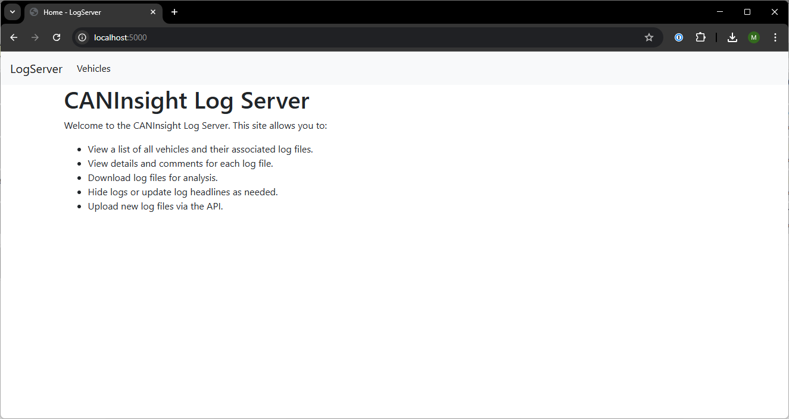
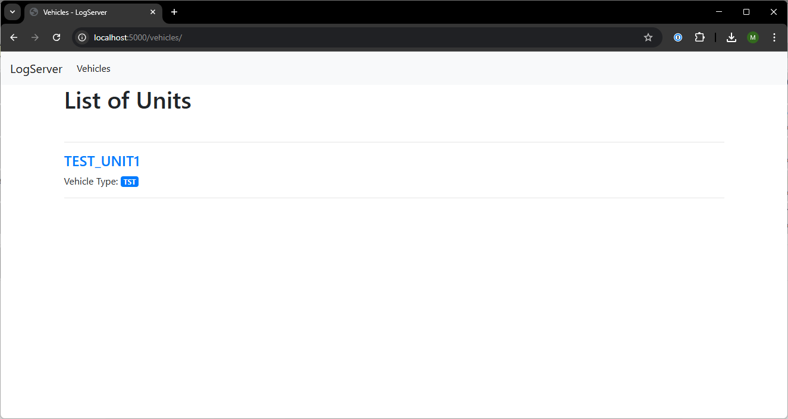
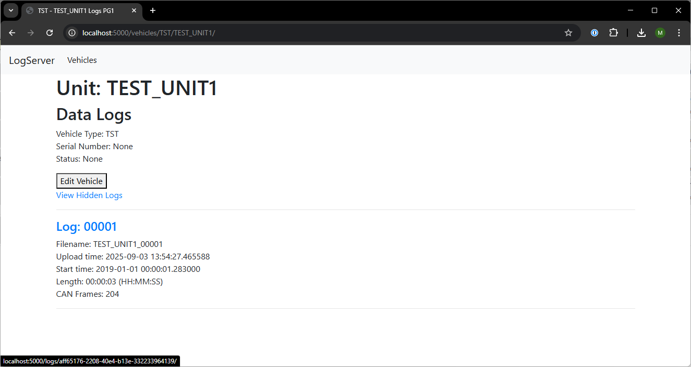
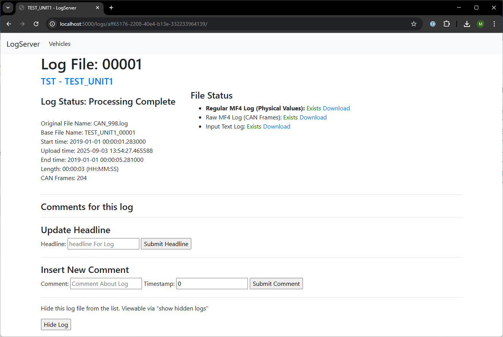

# BusEye Processor

The BusEye Processor is designed to make it simple to get from raw CAN CSV logs → standardized MF4 files → human-readable decoded signals. 

The BusEye Processor is a companion software for the [BusEye CL2](https://perspic.ca/shop/category/can-bus-dataloggers-2) CAN data logger but can work with any data that is in a standard format. It automatically processes incoming log files in CSV format and converts them into industry-standard MF4 files. It also supports DBC decoding to produce human-readable signals in physical units.

Although optimized for BusEye CL2, it can be adapted to work with any CSV-style CAN logs.

## What It Does
The processor continuously monitors the in_logs directory for new log files. When a file is detected:

1. It converts the raw CAN data (CSV) into an .mf4 file.
2. It applies DBC files to decode CAN frames into physical signals (e.g., speed, temperature, pressure).
3. It outputs two .mf4 files:
   Raw CAN Data
   Decoded Signals

These files are saved in the structured out folder for easy access and analysis. 

After processing, the included web application lets users browse, organize, and add comments to log files. All metadata is stored in a database, making it easy to search and manage logs through the web interface.

## How It Works
The project uses the [ASAMMDF library](https://pypi.org/project/asammdf/) to perform the CSV-to-MF4 conversion and DBC signal extraction. The key to its functionality is properly formatting the incoming CSV files so they can be consumed by ASAMMDF's extract_bus_logging function.

## Requirements

**Recommended:** Use Docker for a simple, consistent setup. See **run-docker-compose.md** for details.

**Alternative:** Run directly on any system (Linux or WSL recommended), see **How to Run** section.

**Optional Tools:**
- [ASAMMDFGUI](https://asammdf.readthedocs.io/en/latest/gui.html): View and analyze `.mf4` files.
- [Kvaser Database Editor](https://www.kvaser.com/download/): Create and edit `.dbc` files.

# User Guide
This section explains how to set up folders, run the system, and interact with your data.

## 1. Create the Folder Structure

Before running, select a file location on your PC and create the following folder structure:

```
buseye-processor/ # Example top-level folder
├── in_logs/      # Place incoming CSV log files here
├── out/          # Processed output files go here
└── dbc/          # Store DBC files here
```
- in_logs/ → Drop raw log files here.
- out/ → Processed .mf4 files are automatically organized by unit type and number.
- dbc/ → Store global or unit-specific DBC files.

## 2. Create your DBC files
Using Kvaser Database Editor or similar software, create DBC files for your project. Alternatively, find DBC files online.

## 3. Running the Software

You can run the system either with Docker Compose or locally. See sectiosn below on how to configure and run the software.

## 4. Add Logs for Processing
1. Copy your .csv log files into the in_logs/ folder.
2. The processor will automatically detect new files.
3. Wait a few minutes for conversion and decoding to complete.
4. Output files (raw.mf4 and decoded.mf4) will appear under the out/ directory, organized by unit type and number.

## 5. Browse Files Directly

If you prefer, you can skip the web interface and browse the output files directly

Find the output folder in the project directory and browse the files. You can open .mf4 files using tools such as [ASAMMDF GUI](https://asammdf.readthedocs.io/en/latest/gui.html).


## 5. Using the Web Interface

The included web application provides a convenient way to manage and annotate logs:

- Browse logs → Navigate through processed logs by unit type and number.
- Search & filter → Use the database-backed search to quickly find logs.
- Add comments → Store metadata or notes about specific test sessions.
- Organize results → All metadata is saved in the database for long-term management.

To access the web interface, open your browser and go to:

[http://localhost:5000](http://localhost:5000)

(or the port specified in your Docker/compose configuration).


### Web Interface Screenshots

[](img/web-home.png)
[](img/web-vehicles-list.png)
[](img/web-vehicle.png)
[](img/web-log-details.png)


# Technical setup

## Folders
Create a top-level directory to organize the required subfolders:

```
buseye-processor/ # Example top-level folder
├── in_logs/      # Place incoming CSV log files here
├── out/          # Processed output files go here
└── dbc/          # Store DBC files here
```

### Log file name convention
Log files are named based on the unit number and order in which they were processed. E.G. the first log that the processor encounters for unit123 with a unit type of KUBOTA-M7 will be placed in `out/KUBOTA-M7/unit123/` and will be named `unit123_00001.mf4`. (Leading zeroes are used to ensure sorting by filename is effective).

## Environment Variables and Configuration

The processor supports two database backends: **PostgreSQL** and **SQLite**. Select the backend by setting the `DB_BACKEND` environment variable (`postgres` or `sqlite`). If not set, it defaults to `sqlite`.

## PostgreSQL Configuration

If `DB_BACKEND=postgres`, the following environment variables can be used to configure the database connection (defaults shown in parentheses):

- `DB_USERNAME` (default: `root`)
- `DB_PASSWORD` (default: `root`)
- `DB_HOSTNAME` (default: `localhost`)
- `DB_PORT` (default: `5432`)
- `DB_DATABASE` (default: `logserver_db`)

Example:
```bash
export DB_BACKEND=postgres
export DB_USERNAME=myuser
export DB_PASSWORD=mypassword
export DB_HOSTNAME=localhost
export DB_PORT=5432
export DB_DATABASE=logserver_db
```

## SQLite Configuration

If `DB_BACKEND` is not set or set to `sqlite`, the processor uses a local SQLite database file located in the data folder (e.g., `logserver_db.sqlite3`). No additional environment variables are required for SQLite.

Example:
```bash
export DB_BACKEND=sqlite
```

## Folder: in_logs
Place all CSV log files you want processed in this folder.

## Folder: out
Processed logs are organized into subdirectories using metadata from each log:

```
out/
├── unit_type/
│   └── unit_number/
│       ├── raw.mf4
│       └── decoded.mf4
```

unit_type: Typically a vehicle or equipment type (e.g., Ford-Ranger, KUBOTA-M7)
unit_number: A unique identifier like a serial number or last digits of a VIN

## Folder: dbc
DBC files define how CAN message IDs map to physical signals.

Place global DBC files directly in dbc/

To assign a DBC to a specific unit type, create a subfolder named after the unit type:

```
dbc/
├── global.dbc
├── KUBOTA-M7/
│   └── custom_M7.dbc
└── Ford-Ranger/
    └── custom_Ford_Ranger1.dbc
    └── custom_Ford_Ranger2.dbc
```

# How to Run
See **run-docker-compose.md** for details on how to run the software in docker.

NOTE: The web interface has NO SECURITY. Do not port-forward it to the internet without proper security measures.

## Run Locally
Note: for simplicity, run in linux or WSL.


```bash
apt install python3-pip python3.12-venv # install python and virtual environments
python3 -m venv venv # Create a virtual environment
source venv/bin/activate # activate the virtual environment
pip install -r processor/requirements.txt -r webserver/requirements.txt # Install required pip packages
cd src
export DATA_FOLDER="." # Optional: change data folder to where your data is located
python log_converter.py
```

# Roadmap
- No future improvements currently planned. 


# WSL Notes
For running locally with ubuntu on WSL you must install pgsql library.

``` bash 
sudo apt install libpq-dev
```

# Running tests
cd into src/ folder. Enable virtual environment venv with `source venv/bin/activate`.

To run all tests:
```bash
export DATA_FOLDER="tests/tmp"
python3 -m unittest discover -s tests -p "test_*.py"
```

To run a specific test
`python3 -m unittest tests.test_log_converter`